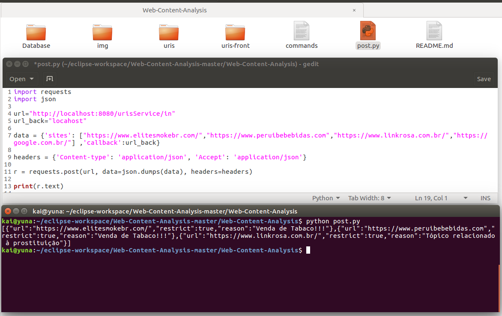

# Web-Content-Analysis

Desenvolvido para a discliplina de MAC5853 Desenvolvimento de Sistemas de Computacao. 

## Project Description
Esse é um projeto da disclipima de MAC5853, para determinar e identificar que sites estão de acordo a determinadas políticas.

(Modificação 05/novembro): Todo o  modelo de classes de dados  e os testes unitarios foram desenvolvidos. 

## Requerimentos

- Java 8
- Tomcat 8.0
- Postgresql 9.3
- Maven 3.3.9
- Angular 5 

## Instalação do Banco de Dados 

O arquivo de bando de dados "DBurlitis.sql" está localizado na pasta DATABASE. 

- A instalação pode ser feito com o seguinte comando: 

  $ sudo -u postgres psql

  $$ create database "DBurlitis"

  $ sudo -u postgres psql -f DBurlitis.SQL DBurlitis

## Instalação no Ambiente (ECLIPSE)

Descargamos o respositorio e extraimos en algum endereço.

      
   

Abrimos o IDE Eclipse e selecionamos como workspace o endereçõ de nossa carpeta $uri$ do repositorio.

      
   

Já estando no ambiente, presionamos Crtl+Shift+R e digitamos Persistence, e clickamos no arquivo.

      
   

A seguir, temos un arquivo onde fazemos a configuração para ter conetividade com o Banco de Dados do Postgresql.

      
   

Logo, procedemos à criação do server tomcat.

      
   

      
   

      
   

e modificamos a variável de entorno do tomcat.

      
   

E por último, selecionamos o modulo URIS-RES e clickamos no butão "run" e escolhemos a opção "Run on server". 

      
   

E vamos para nos browser e escrevemos a seguiente url: "http://localhost:8080/urisService/index". Se o processo de instalação foi feito bem, então deveriamos ter a seguinte resposta.

      
   

# Realizando alguns Testes.

Quando o server está ligado, entao podemos executar o arquivo post.py com o seguinte comando
- python3 post.py

O qual é enviando dados json para a seguinte url "http://localhost:8080/urisService/in", onde é retornado o análise das respetivos sites, e a razao dos seus conteúdos restritos.  

      
   

Hello Kitty!!!

